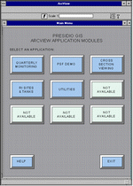

Project experiences from the Presidio of San Francisco

Patrick Kowta,GeoSystems International
&
Gregory Hall, Montgomery Watson Americas, Inc.
Intro

In early 1994, GSI was hired by the U.S. Army Corps of Engineers and Montgomery Watson Americas, Inc. (MW) to support environmental investigations at the Presidio of San Francisco through the use of GIS. As part of these efforts, the GIS staff has developed a series of ArcView applications for use by the project staff and client.

# Components

The applications were designed as a series of modules to allow it to be flexible and extensible. There are currently three types of modules - a Graphical User Interface (GUI), Avenue applications and Data Exploration applications.

# GUI

The GUI was implemented to provide an easy-to-use method of accessing the various Avenue and Data Exploration applications. As you can see in the image below, it consists of a series of buttons, one for each application along with buttons for help and exiting ArcView.

The interface is implemented with a view and hot-linked polygons. Using different colors on the sides of the buttons gives the illusion of highlighting and shading and produces a three dimensional effect.

The interface also includes Avenue code which resizes the windows on the fly to account for different screen sizes and/or resolutions. This allows us to use the application on different computers and with projection devices without hardcoding the window sizes for each size/resolution combination.

# Avenue Applications

There are currently two applications which rely heavily on scripts written with the Avenue programming language. These applications are designed to provide specific functionality at the push of a button. Many of the standard ArcView capabilities which are not relevant to these specific tasks have been disabled to simplify the application. These applications are designed for the non-GIS user who doesn't have time to learn about the many capabilities of ArcView.

The Quarterly Groundwater Monitoring Application is designed to show chemical concentrations and groundwater elevations over time for a series of groundwater wells which will be monitored through the year 2000. Using two data selection parameters that are chosen by the User through dialog boxes, the application scans the hard disk and loads all matching data themes into the view. It also extracts a subset of the chemical database and formats the data for use in the charting module of ArcView. The end result is a view of the site with all the relevant contour themes loaded, a table of the chemical/groundwater data and a time-series graph.

Another Avenue application which has been developed is used for viewing geologic cross sections. The cross sections were created in Techbase using lithologic data extracted from the main database. The final figures were exported in DXF format and additional features such as excavation extents were added in AutoCAD. The final DXF files are then displayed in ArcView by clicking on a hot-linked cross section line displayed on the Presidio base map.

# Data Exploration Applications

The second type of application is used for exploring particular types of data. Each application is implemented as a different project, just like the Avenue applications. These applications, however, don't rely on Avenue scripts. They consist of a view containing all the relevant data themes pre-loaded and symbolized. All of the out-of-the-box ArcView functionality is also maintained. Although this type of application can be easily used by a novice, a GIS staff person generally acts as the "driver".

For example, the Utility Viewing Application can be used by National Park Service maintenance workers and drilling sub-contractors to examine areas where they will be digging. The application contains all the known utility lines on the Presidio. These are all symbolized and linked to the appropriate data tables. Standard base map features such as roads and buildings are also included.

We have also developed a Data Exploration module which includes multimedia capabilities. This was developed in response to a request to present data on a particular site to a panel of experts participating in a Department of Defense project on Natural Attenuation. We had only half a day to present all the environmental investigation data accumulated during five years of work. The panel would then determine the site's suitability for Natural Attenuation based on this information.

ArcView was the natural choice for presenting such a great volume of data in an easily understood manner. In addition to Arc/Info data coverages and database tables, we also needed to integrate other data sources. For example, photographs, cross sections and geologic interpretations were scanned and hot-linked to site features.

Video was also integrated into ArcView using a short Avenue script and the hot-link feature. The script feeds a video file name to a streaming MPEG player through a system call. This launches the video player, plays the video and returns to ArcView. The image to the left is one frame from a video clip which displays a three dimensional model of the site geology. The model was created using Dynamic Graphics' EarthVision software on a Silicon Graphics (SGI) Indy workstation. Images of the model were then "morphed" together in Elastic Reality. The resulting series of images was then compiled using the SGI's moviemaker software. The output SGI movie was then converted to MPEG format and transferred to the Windows NT computer used for ArcView.

# Summary

As the Presidio project evolved over the last three years, our approach to the use of ArcView has changed. It is now clear that there is no single approach to using ArcView that will work for all situations. The key to success is to remain flexible and base your approach to each situation on the knowledge level of the ArcView user and their data requirements.

